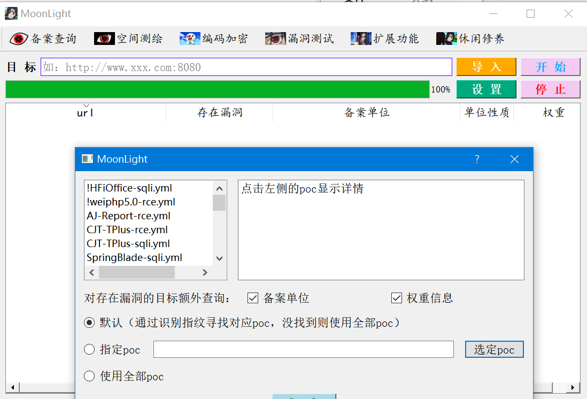

### 1. 简介

使用 go1.20.2 语言进行开发，图形界面为GoQt，使用Qtdesigner进行界面绘制，exe执行程序位于deploy/windows/MoonLight.exe。

主要功能为备案查询、鹰图和fofa空间测绘、常用编码及加密、nday扫描、发送请求包等。

### 2. 功能介绍

备案数据查询域名对应的备案单位等信息，是在简单的信息收集时经常需要收集的信息，权重数据来源于爱站，可能需要用到api查询，可以去爱站获取权重api查询的key，免费的，不过只能查百度PC权重和百度移动权重。当然除此工具外平常也可以自己使用一些在线的查询工具如站长之家工具和爱站。

空间测绘平台为鹰图和fofa，需要在设置中设置相应的key，可以设置多个，能自动进行切换。

编码加密有常见的编码、哈希以及DES、AES等加解密。

漏洞测试这块目前只是一些nday的poc扫描，实现方法参考fscan，可以后续添加yaml格式的poc，对目标url先发起一次请求，根据webfingers.json中的正则匹配规则匹配指纹，能匹配到指纹则调用指定poc，否则调用所有poc进行扫描，也可以在设置中指定poc，请确保合法测试。

扩展功能有发送请求包功能，其他功能可以后续添加到这里。

休闲修养没什么功能就是一些解释，不过在每日一图处可以看看风景图，学习或者工作累了可以偶尔看看图。

风景图看着看着有时容易上瘾哈哈。

最后再补几张家乡的图吧，在外面久了总归是要思乡的.

### 3. 免责声明

在使用本工具时，您应确保您的行为符合当地的法律法规，并且已经取得了足够的授权。**请勿对非授权目标进行扫描。**

如您在使用本工具的过程中存在任何非法行为，您需自行承担相应后果，我们将不承担任何法律及连带责任，本工具如有侵犯到相关版权或利益请联系我并及时删除。

在使用本工具前，请您**务必审慎阅读、充分理解各条款内容**，除非您已充分阅读、完全理解并接受本协议所有条款，否则，请您不要使用本工具。您的使用行为或者您以其他任何明示或者默示方式表示接受本协议的，即视为您已阅读并同意本协议的约束。
